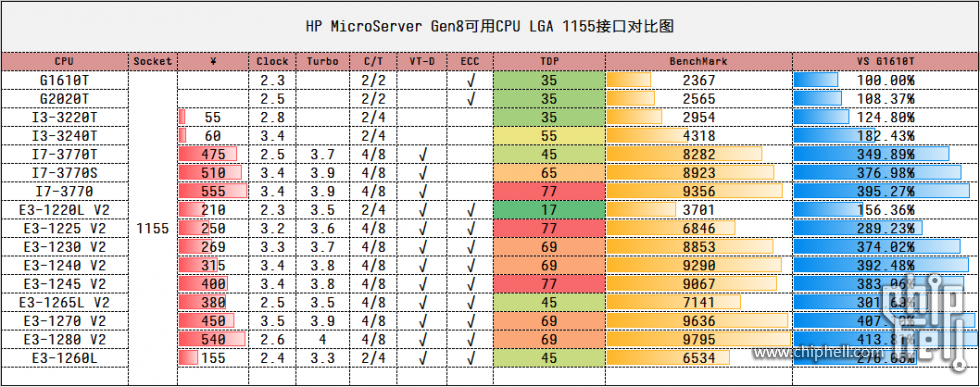
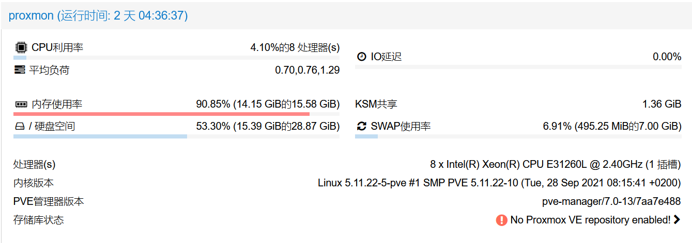

##1
Gen8用了4年了，买的时候是默认的CPU，G1610T,升级了内存，两条4G双通道，装了winserver系统，然后在hyper-V里装ubuntu和openwrt，最近感觉性能有点不行了，而且winserver很臃肿，需要更新重启的时候里面的虚拟机也都要重启，所以还是要搞个专门的虚拟化去做系统，G1610T做虚拟化估计是撑不住，所以动了硬件升级的心思。
##2
了解了下GEN8可用的cpu，去淘宝找了下发现竟然这么便宜，而且E3的性能也够用了，最后为了兼顾价格，性能和功耗，选了个E1260L，才180块，简直太值了。 
图源水印，这个图有点问题，1260L也是4核8线程的。 

##3
这次准备搞个nas系统，可是这玩意挺吃内存的，所以打算内存也升级一下，GEN8只有两个内存插槽，最大16G，所以去淘宝找了两条8G内存，不过GEN8只能用ECC的内存，有点贵，两条内存竟然花了320，本来想把换下来的两条4G内存卖给淘宝卖家的，卖家说55一条回收，说好了到货给钱的，之后再问他们到货多久后给钱就不说了，感觉有点坑，就还是留着了，有需要的可以联系我，我留着也没用。还不如出掉换点米。 

##4
到货换好之后，装了proxmox，然后装了omv，openwrt，winserver，感觉还可以再战好多年，不用换gen10了。非常满意。 
本次升级共花费CPU 180元 +内存 320元，总共500元。
